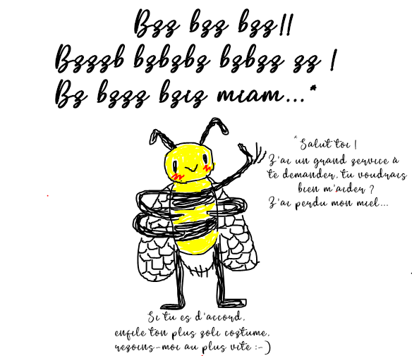
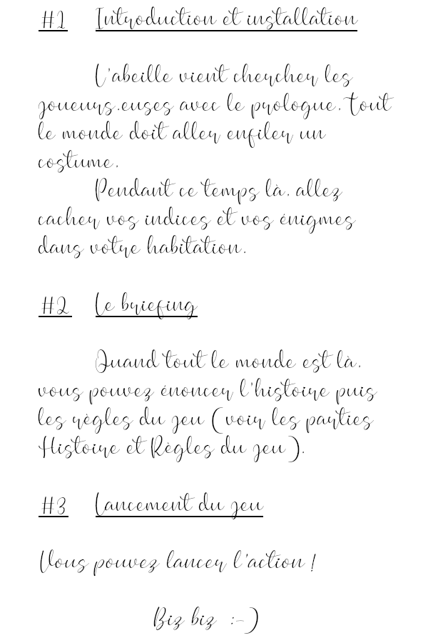

# Le mariage du chèvre et du miel

## L'intrigue 

*Cette partie se passe avant le début du jeu et a pour but de sensibilier le public qu'il va se passer un truc de ouf chez, on commence à instaurer une intrigue.*

Vous passez une belle zournée, peut-être que la routine confinée commence à vous saoûler, mais auzourd'hui votre quotidien va être bouleverzé.
D'un coup d'un seul, une abeille en panique arrive dans votre maison avec un message :

## L'histoire

Comment l'abeille a-t-elle perdu son miel ? Pourquoi il faudrait que je l'aide ? 
Pour l'instant, personne ne sait qui a fait le coup mais nous pensons que le miel a été kidnappé. Pas de bol, aujourd'hui c'était le grand jour pour lui et pour la chèvre, ces deux âmes soeurs allaient s'unir pour former un couple parfait jusqu'à la fin des temps.

# Déroulement du jeu :

https://frama.link/bzzstory00

https://frama.link/beestory01

