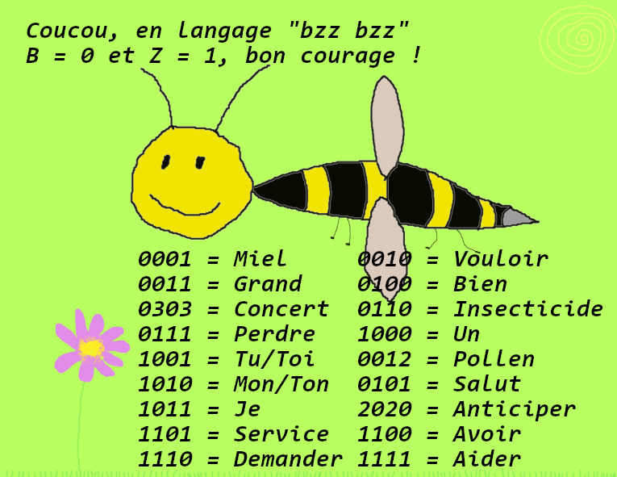

# LE MARIAGE SOMPTUEUX DE LA CHEVRE ET DU MIEL

Salut ! On a crée un jeu à la maison pour se croire à la récré, en théorie c'est très facile à prendre en main et à reproduire chez soi.

Ici j'essaie d'expliquer et de bien récapituler comment ça se passe.

Si tu penses que ça peut faire plaisir à ton entourage, ce jeu est conçu pour être dans un esprit de légèreté et devrait être un bon moment à partager. Il est plutôt prévu pour être joué dans un jardin et au soleil par des personnes de 8 ans et plus mais devrait convenir à n'importe quel endroit. 

**Le jeu est conçu pour au moins 2 joueurs.euses, ton rôle à toi sera d'installer, d'animer et de veiller au bon déroulement du jeu (et bien sûr bien rigoler !)**

## Le jeu est tout à fait libre à interprétation, si celui-ci vous inspire faites vous plaisir, sinon vous pouvez le réadapter à votre guise :-)

# Le prologue

*Cette partie se passe avant le début du jeu et a pour but de prévenir le public que quelque chose va se passer, vous pouvez envoyer l'image aux personnes concernées et leur faire comprendre qu'un jeu va se dérouler chez vous.*

**Vous pouvez leur envoyer séparément le message codé et la clé de résolution (cliquez juste sous l'image) et les inviter ou non à se concerter pour savoir ce que veut dire l'abeille.**

  
Clé de résolution : cliquez ici

  
  
  

# L'histoire

*Cette partie est le briefing avant de lancer l'action*

Après avoir reçu le message de l'abeille et décodé son code, vous avez dû vous poser des centaines de question, pas vrai ?

Ben oui, comment l'abeille a-t-elle perdu son miel ? Pourquoi faudrait-il que je l'aide ? S'agit-il d'un complot du syndicat des apiculteurs pro-Zemmour ? 

C'est vraiment pas de bol, aujourd'hui c'était le grand jour pour le miel et pour la chèvre, les deux âmes soeurs allaient s'unir pour former un couple parfait jusqu'à la fin des temps. Nous sommes à peu près certains que le miel a été kidnappé ! Mais nous ne savons pas qui a fait le coup

**Vous allez devoir aider la chèvre et les abeilles à retrouver le miel, sans quoi le mariage ne pourra pas avoir lieu !**

Pour cela, vous allez devoir interroger les fleurs, on raconte qu'elles ont les pétales très à l'écoute. 
Les abeilles seront parmi vos meilleures alliées, retrouvez les toutes ! 
Il paraît que même Winnie l'Ourson est dans le coin, en temps que grand amateur de Miel il pourra sans doute vous aider dans vos recherches.

## Règles du jeu

Vous pouvez poser les règles que vous voulez pour le jeu, en voici quelques-unes que vous pouvez proposer rien que pour le fun :
- les participant.e.s doivent ajouter des bzz bzz dans leurs phrases
- les participant.e.s doivent se déguiser en abeille ou se préparer pour un mariage pendant que vous installer le jeu
- les participant.e.s doivent se trouver un nom d'insecte et/ou un nom et cri d'équipe

## C'est parti !

### Pour mettre en place le jeu, rendez-vous dans le dossier "énigme" ou sur https://github.com/fenetre42/open-escape/tree/master/enigmes
