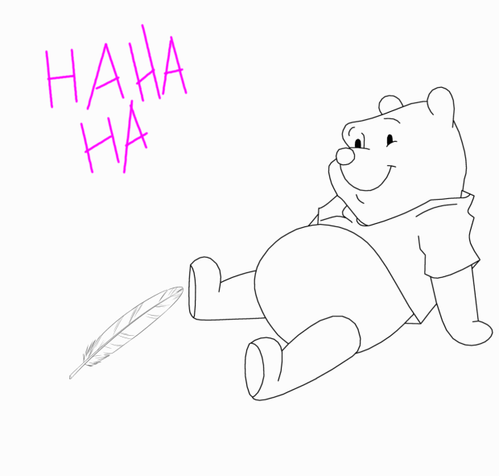

# Grand jeu libre
Salut ! On crée une espèce d'escape game à la maison, je vais essayer de faire en sorte qu'il soit facile à comprendre et prendre en main.
J'essaie d'expliquer comment ça se passe par ici, de bien récapituler, et le contenu du jeu est à trouver dans le dossier des énigmes :-)

Si tu veux faire plaisir à ton entourage, ce jeu devrait être un bon moment à partager !

**Le jeu est prévu pour au moins 2 joueurs.euses, ton rôle à toi sera d'installer, d'animer et de veiller au bon déroulement du jeu***

# Le mariage du chèvre et du miel

## L'intrigue 

*Cette partie se passe avant le début du jeu et a pour but de prévenir le public que quelque chose va se passer, vous pouvez envoyer l'image aux personnes concernées et leur faire comprendre qu'un jeu va se dérouler chez vous.*

Vous passez une belle zournée, peut-être que la routine confinée commence à vous saoûler, mais auzourd'hui votre quotidien va être bouleverzé.
D'un coup d'un seul, une abeille en panique arrive dans votre maison avec un message :

  
Clé de résolution : cliquez ici

  
  
  

## L'histoire

*Comment l'abeille a-t-elle perdu son miel ? Pourquoi faudrait-il que je l'aide ? S'agit-il d'un complot du syndicat des apiculteurs ?*

Pour l'instant, personne ne sait qui a fait le coup mais nous sommes à peu près sûr que le miel a été kidnappé ! C'est vraiment pas de bol, aujourd'hui c'était le grand jour pour lui et pour la chèvre, les deux âmes soeurs allaient s'unir pour former un couple parfait jusqu'à la fin des temps. 

**Vous allez devoir aider le chèvre et les abeilles à retrouver le miel, sans quoi le mariage ne pourra pas avoir lieu !**

Pour cela, vous allez devoir interroger les fleurs, on raconte qu'elles ont les pétales très à l'écoute. 
Les abeilles seront parmi vos meilleures alliées, retrouvez les toutes ! 
Il paraît que même Winnie l'Ourson est dans le coin, en temps que grand amateur de Miel il pourra sans doute vous aider dans vos recherches.

## Règles du jeu

Vous pouvez poser les règles que vous voulez pour le jeu, néanmoins voici celles que l'on propose :
- les participant.e.s doivent ajouter des bzz bzz dans leurs phrases
- les indices servent une seule fois
- la fouille ne se passera pas au dessus du niveau des épaules

## Déroulement du jeu :

Contenu en stock :
https://frama.link/lacanciondemargay

