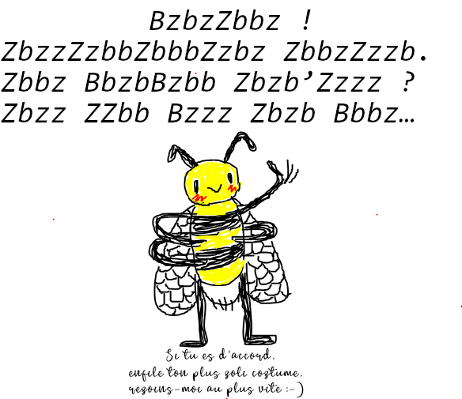

# Grand jeu libre
Salut ! On crée une espèce d'escape game à la maison, je vais essayer de faire en sorte qu'il soit facile à comprendre et prendre en main.

# Le mariage du chèvre et du miel

## L'intrigue 

*Cette partie se passe avant le début du jeu et a pour but de prévenir le public que quelque chose va se passer, vous pouvez envoyer l'image aux personnes concernées et leur faire comprendre qu'un jeu va se dérouler chez vous.*

Vous passez une belle zournée, peut-être que la routine confinée commence à vous saoûler, mais auzourd'hui votre quotidien va être bouleverzé.
D'un coup d'un seul, une abeille en panique arrive dans votre maison avec un message :

## L'histoire

Comment l'abeille a-t-elle perdu son miel ? Pourquoi faudrait-il que je l'aide ? 
Pour l'instant, personne ne sait qui a fait le coup mais nous pensons que le miel a été kidnappé. Pas de bol, aujourd'hui c'était le grand jour pour lui et pour la chèvre, ces deux âmes soeurs allaient s'unir pour former un couple parfait jusqu'à la fin des temps.

## Règles du jeu

## Déroulement du jeu :

