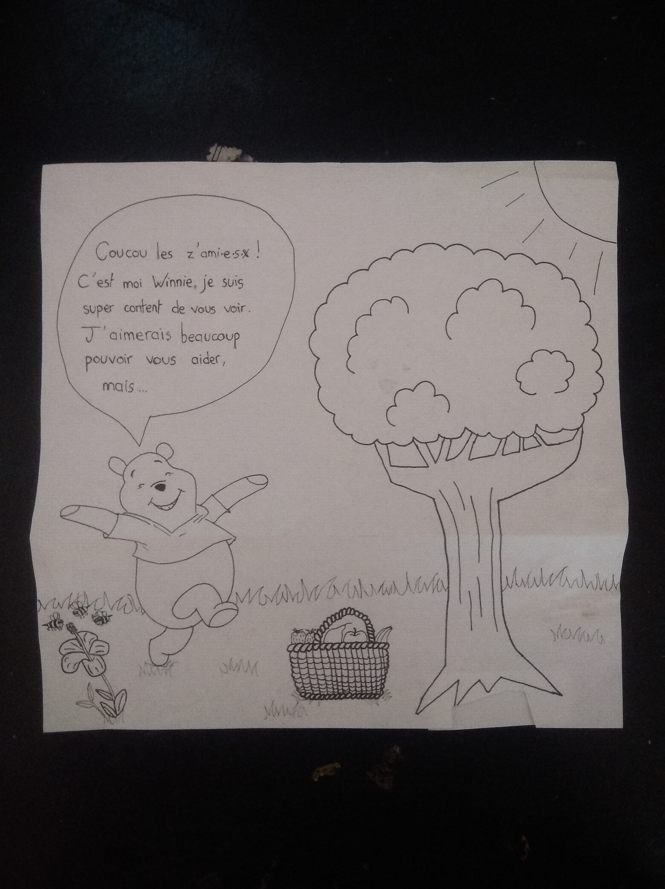
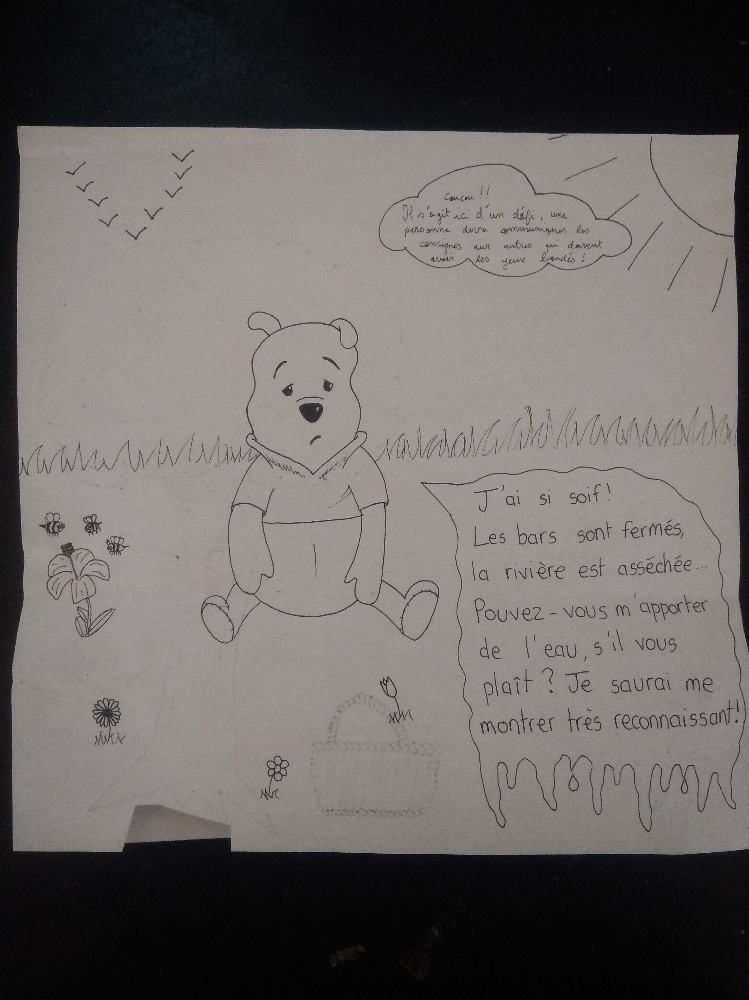

# Winnie vous accueille avec une idée derrière la tête

# Winnie a soif ! Très soif !

**Il demande alors aux joueur.euses de bien vouloir lui ramener un grand verre d'eau !**

Bandez les yeux d'une personne sur deux, celle qui n'a pas les yeux bandés doit guider l'autre avec des consignes orales sur un parcours que vous aurez défini pour faire passer l'eau dans un gobelet d'un point A à un point B.

### Lorsque tout le monde a ramené un verre d'eau (inversez les rôles à un moment), Winnie est satisfait et vous offre Queen Bee, la reine des abeilles qui porte le numéro 8
