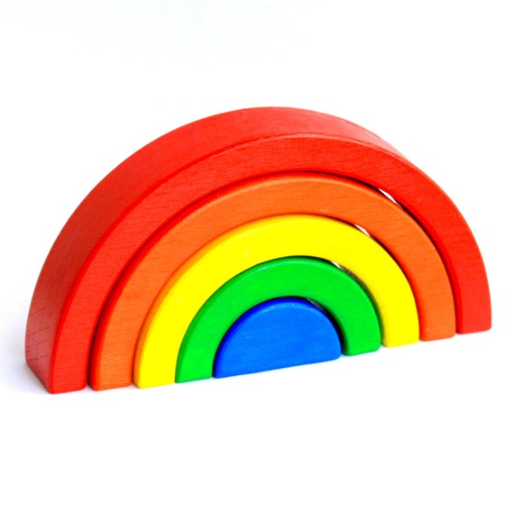

# Cinq fleurs sont cachées dans la maison et contiennent des petits mots qui attendent les joueurs.euses

*Chacun de ces petits mots contient une lettre entourée d'une couleur, il faudra utiliser la clé de résolution arc-en-ciel pour trouver l'ordre des couleurs*

  
Clé de résolution arc-en-ciel, à trouver dans la pièce

 
 Les lettres entourées sur les fleurs 1, 2, 3, 4 et 5 respectivement rouge, orange, jaune, vert puis bleu.

**Première fleur :**
Si je devais vous (é)crire ou vous dessiner, je n'aurais ni assez de mots ni assez de couleurs pour exprimer ce que je ressens pour vous

**Deuxième fleur :**
J’aimerais me marier avec vous comme le chè(v)re et le miel

**Troisième fleur :**
Vous n'êtes peut-être pas des baguettes mais vous êtes mag(i)ques !

**Quatrième fleur :**
Vous êtes plus joli(e)s que des roses et vous sentez meilleur que les Lilas

**Cinquième fleur :**
Vous êtes tellement doux.ce.s que si vous étiez des gâteaux ratés, vous seriez fondant.e.s à inté(r)ieur

## La solution à l'énigme est :

  
cliquez ici

  
  É V I E R
  
  --► Les participant.e.s doivent aller voir au niveau de l'évier. 

# A la fin de cette épreuve, on récupère une boîte fermée par un cadenas à code.
