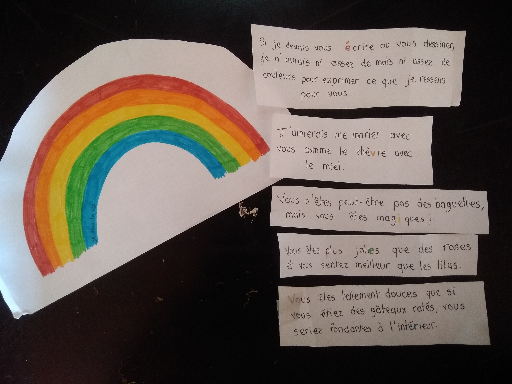

# Cinq fleurs sont cachées dans la maison et contiennent des petits mots qui attendent les joueurs.euses

*Chacun de ces petits mots contient une lettre entourée d'une couleur, il faudra utiliser la clé de résolution arc-en-ciel pour trouver l'ordre des couleurs*

 # On trouve la clé de résolution Arc-en-ciel dans l'espace du jeu
 
 Les lettres entourées sur les fleurs 1, 2, 3, 4 et 5 respectivement rouge, orange, jaune, vert puis bleu.

 
 

  
Les fleurs

Vous pouvez bien sûr changer les fleurs, on s'est dit que 

**Première fleur :**
Si je devais t'(é)crire ou te dessiner, je n'aurais ni assez de mots ni assez de couleurs pour exprimer ce que je ressens pour toi

**Deuxième fleur :**
J’aimerais me marier avec toi comme le chè(v)re et le miel

**Troisième fleur :**
T'es peut-être pas une baguette mais vous t'es mag(i)que !

**Quatrième fleur :**
Tu es plus joli(e) qu'une rose et tu sens meilleur qu'un Lilas

**Cinquième fleur :**
Tu es tellement doux.ce.s que si tu étais un gâteau raté, tu serais fondant.e à inté(r)ieur

## La solution à l'énigme est :

  
cliquez ici

  
  É V I E R
  
  --► Les participant.e.s doivent aller voir au niveau de l'évier. 

# A la fin de cette épreuve, on récupère une boîte fermée par un cadenas à code cachée quelque part près de l'évier.
