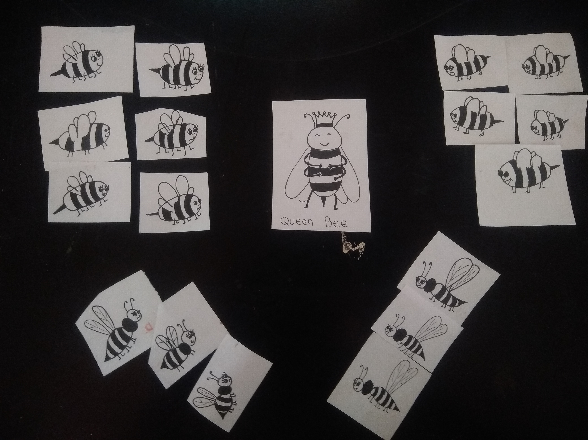
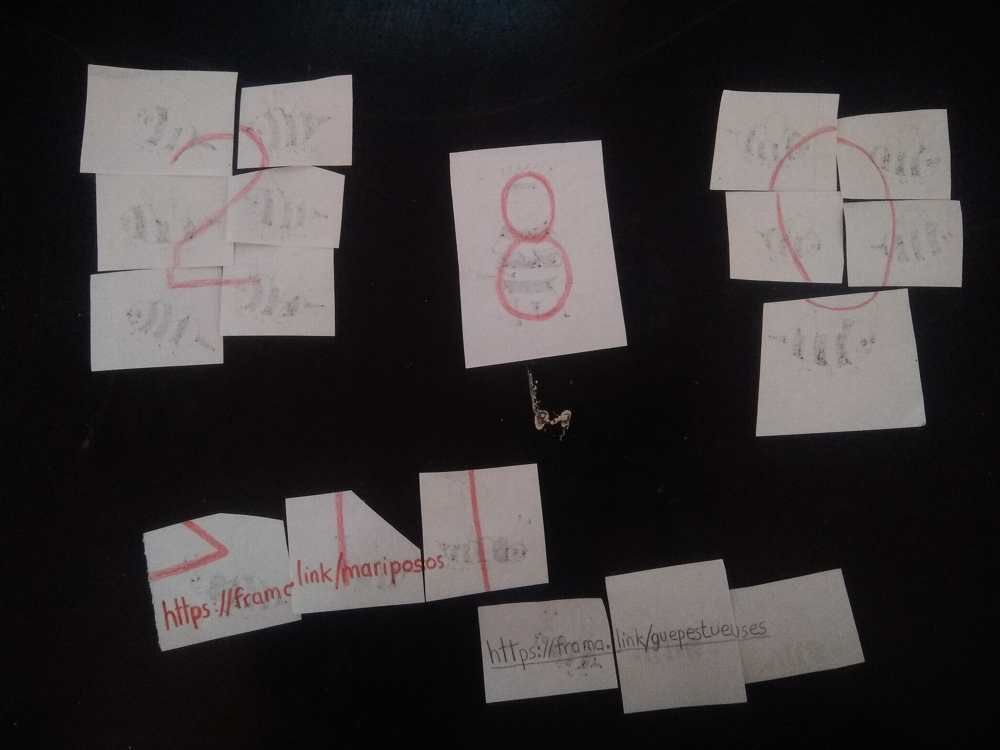

# Une douzaine d'abeilles sont cachées dans la maison

**Chacune de ces petites abeilles porte un bout de chiffre dans son dos, il faut toutes les retrouver !**

**Notez que les guêpes en dessous ne sont pas des abeilles et que Queen Bee est obtenue à l'épreuve de Winnie**

 
 
 # Les guêpes viennent fausser les pistes
 
*Les guêpes sont légèrement différentes et les joueur.euses devraient capter cette différence après plusieurs minutes de jeu. Elles permettent ici de partager divers contenus créatifs, leur faire perdre un peu de temps pour se renseigner sur les guêpes tueuses en Chine, donner quelques indices et changer l'atmosphère.*
 
 

## Grâce aux abeilles on obtient les chiffres 2 et 0. Vous pouvez comme nous jouer avec le sens dans lequel les abeilles regardent, en les regroupant on peut former ces numéros là très facilement.
**La Queen Bee qui porte le numéro 8 sera donnée par Winnie l'Ourson après son défi.**
